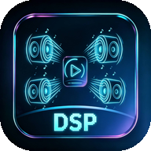
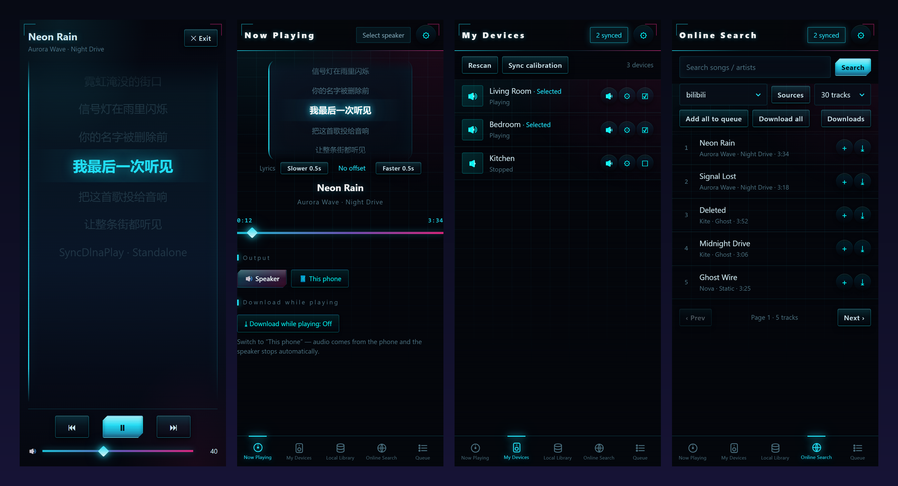

<div align="center">



# SyncDlnaPlay

**勾选局域网里的多台 DLNA 音响，它们同一秒一起响 —— 或者直接用手机放。**
**不要账号、不上云、不要求家里架服务器。**

[](#安装)
[](#android-独立版)
[](#功能特性)
[](#许可证)

[简体中文](#功能特性) · [English](README.md)



</div>

---

**SyncDlnaPlay** 是一款赛博朋克风格的音乐播放 / DLNA 投放工具，**全部功能都跑在手机本机**：
本地音乐播放、在线搜歌下载、一次勾选多台局域网 DLNA 音响**同时播放**（真·多房间同步）、滚动歌词与全屏沉浸歌词。

项目包含两个相互独立的部分：

| | [📱 Android 独立版](#android-独立版) | [🐳 Docker 控制点](#docker-控制点) |
|---|---|---|
| 运行在 | 任意 Android 8.0+ 手机 | iStoreOS / OpenWrt / 任何有 Docker 的 NAS |
| 需要服务器 | **不需要**，全部进程内运行 | 它本身就是服务器（网页端口 5000） |
| 在线音源 | ✅ MusicFree 插件生态 | ➖（浏览 DLNA / SMB 曲库） |
| 适合 | 手机 → 音响，走到哪用到哪 | 无头设备 → 全屋音响 |

---

## 功能特性

### 🔊 投屏 DLNA 音响，真·多房间同步
- 自动发现局域网里的 DLNA/UPnP 音响（斐讯音箱、小爱、电视、AV 功放……）
- 可同时勾选**多台音响组成同步播放组**
- 每台音响独立**延时校准**（0~5000ms）：先出声的那台加一点延迟，物理上对齐多台设备；
  「同步校准」可自动测量
- 不依赖 AirPlay 2 / Chromecast，便宜的老设备也能组网

### 📱 没有音响也绝不卡死
- 局域网里发现不到 DLNA 设备时，播放**自动回落到手机本机**——弹个提示，而不是报错
- 「🔊 音响播放 / 📱 手机本机」一键切换，另一边自动停

### 💽 本地曲库开箱即用
- 手机音乐经 **MediaStore** 自动扫描，无需手动刷新
- 可添加**多个音乐目录**：设备存储、SD 卡、U 盘（系统文件选择器任选）
- 支持 **SMB 网络共享**：「扫描局域网」自动找 NAS / 电脑，「浏览共享」一层层点进去选目录，
  不用记路径

### 🌐 在线搜歌下载，音源自己做主
- 基于 [MusicFree](https://github.com/maotoumao/MusicFree) 插件生态：内置多个社区音源，
  也可通过**网址 / 分享码 / 订阅 JSON / 本地 .js 文件**添加自己的音源
- 内置音源可停用；可设**默认音源**；**自动记住上次搜索用的音源**，下次打开就是它
- 关键词搜索 + 翻页；单曲下载（不足 1 分钟的试听片段自动跳过）
- **边听边下载**：一个开关，播到哪下到哪，落盘在文件管理器可见的公共目录（默认 `Music/…`）

### 📝 歌词体验
- 本地歌读同名 `.lrc`（UTF-8/GBK），在线歌向音源请求
- 投音响的传输延时随文件大小浮动，提供**手动 ±0.5s 快慢校准**（上限 ±10s，自动记住）
- **沉浸模式**：双击歌词进入全屏，发光大字自动滚动，底部固定播放控制与音量
- 点任意歌词行跳转播放

### 🎛 播放细节
- **进度平滑器**：投屏进度按手机时钟外推、滤掉上报噪声，拖动进度条不会来回跳
- 队列管理：跳播、移除、清空、随机 / 列表循环 / 单曲循环 / 顺序播放
- 音量面板可作用于音响组或手机，±1 步进、长按连调
- 赛博朋克 HUD 视觉、全矢量图标、深色主题

### 🌍 中英双语
- 跟随系统语言自动切换，也可在「设置」里手动切换

---

## 安装

### Android 独立版

从 [**Releases**](../../releases) 下载 APK 直接安装（Android 8.0+）。

> 未上架应用商店，需要允许「安装未知应用」。除曲库读取与保活通知外不申请多余权限。

### Docker 控制点

适合无头设备（NAS / 路由器）脱离手机、常年给全屋音响供歌：

```bash
git clone https://github.com/nikeat-cpu/SyncDlnaPlay.git
cd SyncDlnaPlay
docker compose up -d --build      # 网页控制台 http://<host>:5000
```

> **必须 `network_mode: host`** —— SSDP 发现依赖组播，bridge 网络会隔离组播导致发现不到任何音响。
> 完整部署说明、iStoreOS 踩坑记录与排障手册见 **[docs/DOCKER.zh-CN.md](docs/DOCKER.zh-CN.md)**。

镜像基于 `python:3.12-alpine`，Web 层是自研的 Flask 兼容子集，**零第三方依赖**——
**仅 59MB**，秒级构建、内存占用极低。音频流不经过容器：音响直接向音乐源拉流。

---

## 工作原理

```
Android 独立版                             Docker 版
┌─────────────────────────────┐          ┌──────────────────┐
│ WebView UI（SPA，中英双语）   │          │  Web UI (:5000)  │
│ ├─ 内置 HTTP 服务  :8765     │          │  UPnP 控制点      │
│ ├─ DLNA 控制点              │  SSDP    │  （纯标准库）      │
│ ├─ SMB 客户端 (jcifs-ng)    │ ───────► └────────┬─────────┘
│ ├─ MediaStore 曲库          │                   │ SetURI + Play
│ └─ MusicFree 插件运行时      │                   ▼
└──────────────┬──────────────┘          ┌──────────────────┐
               │ SetURI + Play           │    DLNA 音响      │
               ▼                         │   （负责发声）     │
        ┌──────────────────┐             └────────┬─────────┘
        │    DLNA 音响      │                      │ HTTP GET
        │   （负责发声）     │ ◄────────────────────┘
        └────────┬─────────┘        音响直接从音乐源拉取音频流，
                 │ HTTP GET         控制端零带宽消耗
                 ▼
      手机存储 / SMB / 在线 CDN
```

控制端只负责「发号施令」，**音频流从音乐源直达音响**，手机与容器几乎零负载。

---

## 从源码构建 Android 版

不依赖 Gradle，纯工具链脚本（aapt2 → javac → d8 → 打包 → 签名）：

```bash
# 1) 一次性准备：JDK 17 + build-tools 34 + platform android-34
bash android/setup_toolchain.sh

# 2) 构建
cd android
ANDROID_TOOLCHAIN=/path/to/android-toolchain bash build.sh
# 产物：android/build/SyncDlnaPlay-standalone-vX.Y.apk
```

仓库自带桌面回归：`bash android/tools/run_e2e.sh` 会在本机 8765 起真实 Java 后端，
用无头 Chromium 驱动真实前端跑 **32 项端到端检查**（在线搜索、流解析、Range、歌词解析、全部面板）。

---

## 目录结构

```
SyncDlnaPlay/
├── README.md / README.zh-CN.md
├── docs/
│   ├── DOCKER.zh-CN.md        ← Docker 版完整部署文档（中文）
│   └── screenshots/
├── Dockerfile                 ┐
├── docker-compose.yml         ├─ 🐳 Docker 控制点（零第三方依赖）
├── app/                       │    server.py / upnp.py / miniweb.py / static 网页
├── musicfree-bridge/          ┘    在线音源解析桥（可选）
└── android/                       📱 独立版 App（无 Gradle 构建链）
    ├── app/  (java + assets/www + res)
    ├── libs/ (jcifs-ng, bcprov, slf4j-nop)
    ├── build.sh / setup_toolchain.sh
    └── tools/ (E2E、截图、图标与打包脚本)
```

---

## 常见问题

<details>
<summary><b>发现不到音响</b></summary>

手机和音响需在同一 Wi-Fi；部分路由器开了 **AP 隔离**会屏蔽发现协议。发现不到也没关系，
播放会自动回落手机本机。
</details>

<details>
<summary><b>下载的歌在哪</b></summary>

手机公共音乐目录（默认 `Music/…`），任何文件管理器与音乐 App 都可见。
可在「曲库管理 → 下载目录」更换（支持 SD 卡 / U 盘）。
</details>

<details>
<summary><b>投音响时歌词慢几秒</b></summary>

投屏延时随文件大小浮动。在「正在播放」页用 <b>慢 0.5s / 快 0.5s</b> 校准，偏移会记住。
</details>

<details>
<summary><b>在线音源解析失败</b></summary>

音源是社区维护的第三方接口，偶有故障。换个音源，或在「音源管理」里添加自己的插件。
</details>

<details>
<summary><b>耗电与后台</b></summary>

App 只在使用时工作；投屏播放时用常驻通知防止系统杀后台。
</details>

<details>
<summary><b>数据会上传吗</b></summary>

无统计、无账号、无遥测。除你主动搜索的在线音源外，一切数据都留在局域网内。
</details>

---

## Roadmap

- [ ] 车机 / 蓝牙输出目标
- [ ] 歌词翻译行
- [ ] F-Droid / Play 上架评估
- [ ] Docker 版队列持久化

欢迎 PR —— 前端是零依赖 SPA（`android/app/assets/www`），改界面只需要一个文本编辑器。

## 参与贡献

1. Fork & 建分支
2. `bash android/tools/run_e2e.sh` 保持 32/32 全绿
3. 界面文案需同时更新中英两份（`android/app/assets/www/i18n.js`）
4. PR 里说明用户可感知的变化

## 许可证

[MIT](LICENSE) © SyncDlnaPlay contributors

> 在线音源为社区维护的第三方插件。SyncDlnaPlay 仅是播放工具，
> 请尊重所流媒体/下载音乐的版权，仅供个人学习与欣赏使用。
